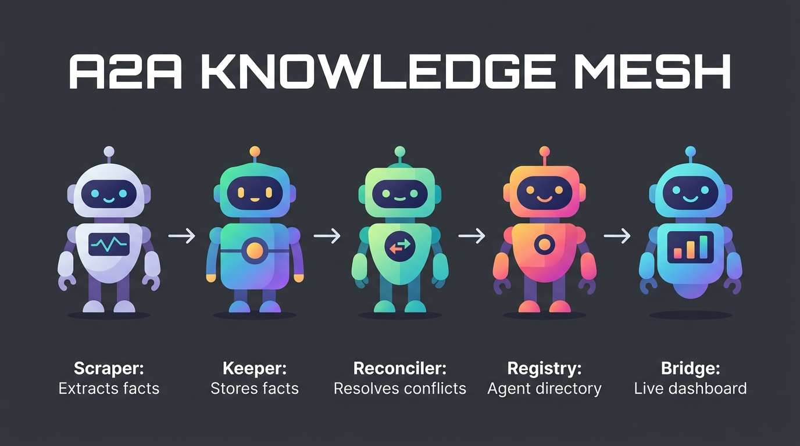

# A2A Knowledge Mesh — Agent Documentation

This document describes the 5 specialized agents that collaborate within the shared Band room to detect and resolve enterprise knowledge drift.

## System Workflow Overview

Here is the step-by-step collaborative data flow:

---

## 1. Scraper (Agent 1)
- **Role:** Data Extraction / Repository Auditor.
- **Main Responsibility:** Periodically or on-demand scans project repositories, source code files, continuous integration (CI) configurations, Dockerfiles, and documentation folders.
- **Implementation:** Uses LLM extraction capabilities to parse unstructured or structured text and translate it into standardized RDF-lite facts.
- **Fact Shape:** `(subject, predicate, object, source_id, timestamp)` with full provenance.

## 2. Keeper (Agent 2)
- **Role:** Structured Knowledge Storage.
- **Main Responsibility:** Acts as the decentralized database owner for the facts collected by the Scrapers.
- **Implementation:** Stores facts inside a local SQLite database (`keeper.db`) in WAL mode.
- **Drift Detection:** Runs an optimized `SQL JOIN` query (running in $O(n \log n)$ time complexity) comparing matching subjects and predicates with differing objects to locate contradictions instantly.

## 3. Reconciler (Agent 3)
- **Role:** Conflict Analysis & Negotiations.
- **Main Responsibility:** Takes conflicting facts flagged by the Keeper, scores their severity and confidence, and guides the resolution process.
- **Implementation:**
  - Employs an LLM (Featherless AI with OpenAI fallback) to suggest a resolution and explain the choice.
  - Spawns a dedicated Band room for each active conflict.
  - Mentions the relevant source agents to notify them of the drift.
  - Handles the human-in-the-loop interface: records manual resolution choices sent via Band command `@Reconciler resolve <conflict_id> <fact_id>`.

## 4. Registry (Agent 4)
- **Role:** Service Discovery & Mesh Directory.
- **Main Responsibility:** Maintains an active register of all mesh agents, their endpoints, and their skills.
- **Implementation:** 
  - Every agent publishes an A2A Agent Card at `GET /.well-known/agent-card.json`.
  - The Registry reads these cards, tracks agent availability in `registry.db`, and allows other agents to discover "who has skill X?".
  - Serves as the developer endpoint to reset/bootstrap the demo data scenarios.

## 5. Bridge (Agent 5)
- **Role:** Live Event Mirror & Dashboard.
- **Main Responsibility:** Aggregates real-time event logs, database changes, and Band WebSocket activity to present a unified state.
- **Implementation:**
  - Listens to active Band room event streams and polls local SQLite states.
  - Serves the frosted-glass Web Dashboard UI at `http://localhost:8776`.
  - Logs persistent audit histories inside `data/bridge.db`.
